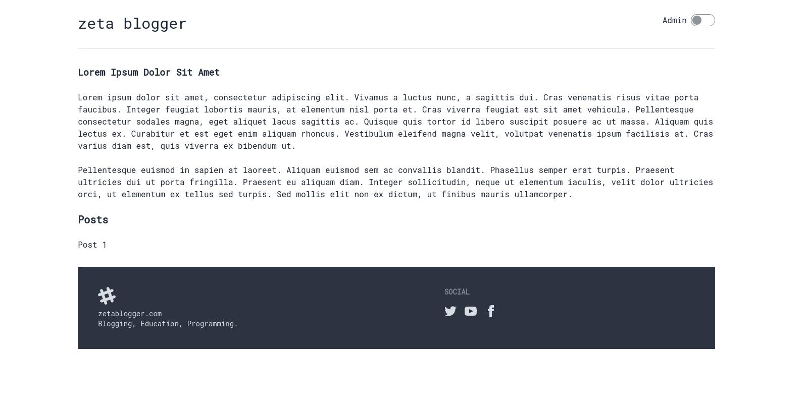

# A light blogging CMS written in Golang

Note: this is a study project and is only meant to give you ideas or serve
for educational purposes. For this reason, certain things might
be implemented non-optimally or incorrectly.

## how-to
- run with: ```make run-dev or make run```
- build with: ```make build```
- test with: ```make test```
- css,html,js static building with: ```npm run dev```

## features
- make build system
- main page + page per blog post
- admin panel with login/logout
- create, update, delete posts
- light/dark mode
- footer

## tech
- Go language
- Golang's html/template
- Tailwind + DaisyUI + Vercel for static building

## learning resources
- [Boredstack repository from Anthdm](https://github.com/anthdm/boredstack/)
- [Web Development w/ Google’s Go (golang) Programming Language from Todd McLeod](https://www.udemy.com/course/go-programming-language/)

## images

